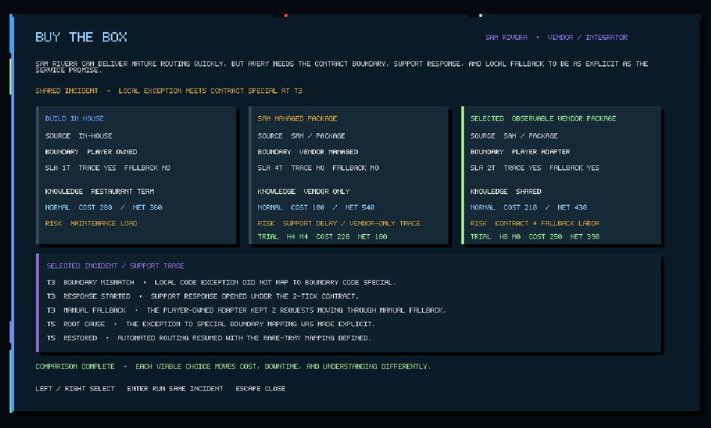

# Feature Screenshot Gallery

This is the reviewer-facing visual index for delivered session features. The PNGs are inspected outputs from the native Stride journey, not golden-image tests. Headless tests, replay proofs, content compilation, and the evidence recorded in `35_SESSION_BACKLOG.md` remain authoritative for behavior that cannot be proven by a frame.

## Current integrated build

The retained set was captured on 2026-08-12 from the integrated S001–S033 build by `tools/ui-smoke.ps1`. The run completed `EpisodeComplete`, passed the 3/3 live reliability window, wrote playtest evidence, exercised every lens, validated placement/undo/reset and save/restore, ran the copied and fitted two-station trials, named Strategy, compared managed and observable vendor contracts under the same incident, rendered the representative benchmark, and resumed with all prior evidence plus both vendor trials intact.

## Historical delivery mapping

| Session | Delivered feature | Reviewer frame | What the frame establishes |
|---|---|---|---|
| S001 | Direct Player Navigation | [reality](screenshots/first-shift/reality.png) | Walkable room, player position, fixtures, and world projection |
| S002 | Context Interaction | [placement/runtime HUD](screenshots/first-shift/placement.png) | Selected target, distance, disabled reason, and contextual action surface |
| S003 | Mouse Camera Controls | [4K scaling](screenshots/first-shift/4k-scaling.png) | Native viewport projection at the large-window scaling gate |
| S004 | Input Action Map | [shift handbook](screenshots/first-shift/shift-handbook.png) | Player-facing logical bindings and contextual capability guidance |
| S005 | Client Screen and Modal Router | [quest detail](screenshots/first-shift/quest-active-detail.png) | Gameplay-owned quest modal reached through the screen router |
| S006 | Interaction HUD Pass | [placement/runtime HUD](screenshots/first-shift/placement.png) | Target, range, action prompt, and causal feedback |
| S007 | Settings Foundation | [comfort setup](screenshots/first-shift/intro-comfort.png) | Reduced-motion and high-contrast onboarding choices |
| S008 | Real Asset Import Spike | [reality lens](screenshots/first-shift/reality.png) | Imported/native room presentation in the running client |
| S009 | Presentation Catalog | [reality lens](screenshots/first-shift/reality.png) | Catalog-resolved workstation and room presentation |
| S010 | Modular Dish Room Kit | [process lens](screenshots/first-shift/process.png) | Integrated modular station layout and item flow |
| S011 | Walkability and Obstacles | [placement](screenshots/first-shift/placement.png) | Valid fixture placement and route-length consequence |
| S012 | Character Presentation Slice | [shift window](screenshots/first-shift/shift-window-running.png) | Player/new-hire projections during live operation |
| S013 | Audio Feedback Slice | [runtime lens](screenshots/first-shift/runtime.png) | Integrated incident moment whose accepted transitions drive audio cues; audio itself requires the native run |
| S014 | Content Schema v1 | [active quest detail](screenshots/first-shift/quest-active-detail.png) | Compiled authored quest situation, outcome, participants, and discovery surface |
| S015 | Externalize First-Shift Narrative | [intro welcome](screenshots/first-shift/intro-welcome.png) | Externalized chapter briefing presented in client |
| S016 | Externalize Dish Scenario | [process lens](screenshots/first-shift/process.png) | Content-configured dish queues, layout, and operating state |
| S017 | Content Validation Test Project | [journal complete](screenshots/first-shift/journal-complete.png) | Validated production content projected as a complete quest journal |
| S018 | Deterministic Template Expansion | [benchmark](screenshots/first-shift/benchmark.png) | Integrated generated workload presentation; determinism remains headless-tested |
| S019 | Workstation Template Family | [process lens](screenshots/first-shift/process.png) | Reusable workstation family projected as the dish process |
| S020 | Incident Template Family | [runtime lens](screenshots/first-shift/runtime.png) | Authored incident state and causal decision trace |
| S021 | Process Capture Model | [process lens](screenshots/first-shift/process.png) | Player-owned process consequence visible in the integrated process view |
| S022 | Process Editor v1 | [responsibility lens](screenshots/first-shift/responsibility.png) | Applied delegation/ownership consequences from the edited process |
| S023 | Automation IR v1 | [automation lens](screenshots/first-shift/automation.png) | Inputs, bounded decision, effect, and retained human responsibility |
| S024 | Automation Rule Editor v1 | [automation lens](screenshots/first-shift/automation.png) | Applied player-authored washer rule in live projection |
| S025 | Presets and A/B Compare | [shift review](screenshots/first-shift/shift-review-detail.png) | Evidence-driven validation quest after controlled comparison |
| S026 | Character Schema and Restaurant Cast | [active quest detail](screenshots/first-shift/quest-active-detail.png) | Stable participant names and roles resolved into the quest surface |
| S027 | Contextual Dialogue and Barks | [shift window](screenshots/first-shift/shift-window-running.png) | Character-reactive live shift presentation; routing/cooldown remains deterministically tested |
| S028 | First-Shift Narrative Pass | [completed quest detail](screenshots/first-shift/quest-complete-detail.png) | Coherent authored chapter outcome and discovery record |
| S029 | Lightweight Shift Economy | [shift report](screenshots/first-shift/shift-report.png) | Frozen value, labor, staffing, rework, shortage, incident, investment, total-cost, and net scorecard |
| S030 | Two Stations, One Problem | [two-station routing board](screenshots/first-shift/two-stations.png) | Same routing decision slot at both stations, demand-fitted policies, zero-shortage outcome, and authored discovery |
| S031 | Pattern Knowledge and Codex Foundation | [pre-name Pattern Codex](screenshots/first-shift/pattern-codex.png) | Player-owned encountered/applied records, causal consequences, recognition, and deliberately withheld conventional name |
| S032 | Name the Pattern | [Strategy Pattern reveal](screenshots/first-shift/strategy-pattern.png) | Evidence-gated conventional name, concrete structure, benefits, costs, and the player's two causal outcomes |
| S033 | Vendor and Outsourcing Side Arc | [completed vendor comparison](screenshots/first-shift/vendor-comparison.png) | Same boundary mismatch, distinct support/visibility/fallback terms, two viable outcomes, and no universal winner |

## Additional retained review frames

- [player tools locked](screenshots/first-shift/player-tools-locked.png)
- [intro guidance](screenshots/first-shift/intro-guidance.png)
- [progression receipt](screenshots/first-shift/progression-receipt.png)
- [early journal](screenshots/first-shift/journal-early.png)
- [state lens](screenshots/first-shift/state.png)
- [knowledge lens](screenshots/first-shift/knowledge.png)
- [automation lens](screenshots/first-shift/automation.png)
- [responsibility lens](screenshots/first-shift/responsibility.png)
- [sandbox tools](screenshots/first-shift/tools.png)
- [career continue](screenshots/first-shift/career-continue.png)
- [new-career confirmation](screenshots/first-shift/career-new-confirm.png)
- [career resumed](screenshots/first-shift/career-resumed.png)
- [Pattern Codex after career resume](screenshots/first-shift/pattern-codex-resumed.png)
- [named Strategy page after career resume](screenshots/first-shift/strategy-pattern-resumed.png)
- [managed vendor incident](screenshots/first-shift/vendor-managed-incident.png)
- [vendor comparison after career resume](screenshots/first-shift/vendor-comparison-resumed.png)

## Refresh contract

For each new delivered client-facing session:

1. Extend the native journey so it reaches the feature through its real player/application path.
2. Capture the smallest frame that visibly demonstrates the outcome.
3. Run `./tools/ui-smoke.ps1 -AllowDesktopInput -RetainScreenshotsPath docs/screenshots/first-shift` on an idle Windows desktop. In a detached Windows session, add `-SemanticOnly`; this skips pointer assertions but still drives authoritative controls and saves actual Stride back-buffer frames.
4. Inspect the changed frame and add the new session mapping here.
5. Commit the screenshot with the implementation only after the representative headless and automated gates pass.

When a feature is entirely engine-neutral or content/tooling-only, retain a frame of its integrated player-visible consequence and state that limitation explicitly. Do not invent a presentation solely to manufacture screenshot evidence.
